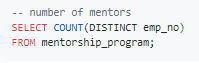

# Pewlett-Hackard-Analysis

  The manager wanted to know the impact of “silver tsunami”. He would need to know how many new recruits he would need to hire to compensate for his retiring employees. He would also need to identify which ones of those employees would qualify to mentor the next generation of Pewlett Hackard employees.
  
  I created group files that had some of the infomation that the manger disired (retiring_employees_info, current_employees, employees_info , ect.) using inner join and the given data. Then created two better files that had all the infomation that the manger wanted (unique_retirement_employees_titles and mentorship_info). I was able to get rid of any duplications using the partition method and organized them using the employee number. I also created the infomation to get the salary but was unable to connect it to my main files. 

  The total amount of employees that can retire is 33,118 but only a total of 2,382 are eligible for the mentorship program. The next thing I would do is make a data table with the count of retiring employees by titles to be able to see how many recruits he would need in each department. I would also do it for the employees that qualify for the mentorship program to be able to see how many puplies each mentor would need to take on. 

### Delivering Results: Technical Report

**Summary Results**

Number of individuals retiring:

(90,398 is the number of indiividuals available for mentorship role)

**Recommendation**

According to the data 
- There are multiple duplicate: need to clear duplicates
- Maximum number of senior enineers are retireing: need to act on it

### Technical Deliverable 1

**Table with retiring employees (create a table containing the number of employees who are about to retire: those born 1952-1955)**

**No duplicates**

### Technical Deliverable 2

**Mentor employees will need to have a date of birth that falls between January 1, 1965 and December 31, 1965**

Total number of eligible mentors are 1549. 

